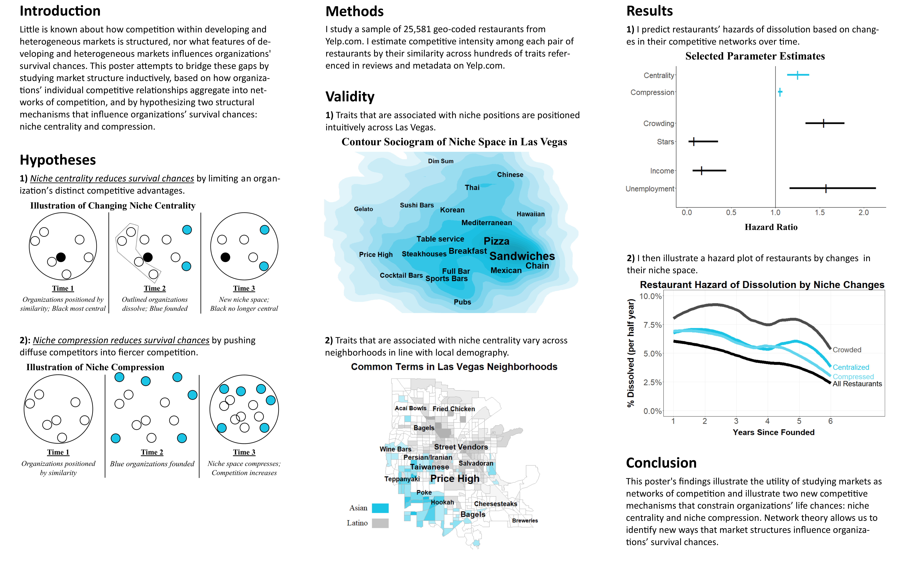

Yelp Competitive Networks
=====

  

# About

This repository was written in 2015 - 2018. It uses social network analysis to model competition among restaurants on Yelp.com and to predict restaurant closure and market change. Data is primarily drawn from the Yelp Challenge Dataset and the American Community Survey, and methods rely on a mixture of social network analysis, clustering analysis, topic models, hazard models, and multi-level models. Results indicate that: 1) A restaurants' propensity to close is highly predicted by changes in its competitive position  (i.e. niche centrality and niche compression); 2) The stability of a local market's offerings are principally predicted by the degree to which its niches are already well-defined (i.e. the markets' niche redundancy, residential succession, and organizational maturity).

# Usage
This repository was built only for personal use, so it requires a few steps for migrating to a new computer. New users must first:
- Download the January 2018 version of the Yelp Competition Datset. I am unsure whether the repository will work for earlier or later versions of this dataset.
- Attain API access for the American Community Survey.
- Install all required libraries used in the repository.

Afterwards, users are advised to run all scripts within the "Code" directory in the order of their numerical prefixes. Scripts without a numerical prefix should be run after scripts with numerical prefixes are run. 

# Details
Within the code directory, files are split into three folders with descriptive names: `1) Data Preparation`, `2) Models and Tables`, and `3) Visualizations`. Each folder contains two subfolders titled `1) Business-Level` and `2) Neighborhood-Level`. These folders indicate the level-of analysis, with `1) Business-Level` referring to files that develop a business-level dataset and with `2) Neighborhood-Level` referring to files that develop a neighborhood-level datasets.

Below is a brief overview of each script by meaning and folder.

### 1) Data Preparation/1) Business-Level/
- **01 - JSON to R.R**
    - Converts all raw Yelp data from JSON to .rds format. 
- **02 - Create business review variables.R**
    - Creates business-level variables based on reviews of that business, including variables for review counts (rev_count), date opened (date_open), date closed (date_close), life span (age), and popularity (pop).
- **03 - Create business super city and category variables.R**
    - Creates a super categories (cat_super) for businesses to help indicates whether a business is a restaurant, and a super city/larger metropitan area (city_super) for identifying larger geographic areas in the dataset.
    - Save RDS
- **04 - Limit data to restaurants.R**
    - Subsets the dataset to places with the supercategories restaurants, nightlife, and food. It also removes foreign cities and meaningless categories from the dataset.
- **05 - Create attributes dataset.R**
    - Transforms Yelp's business attributes list into a dataframe.
- **06 - Modify attributes dataset.R**
    - Modifies and merges the attributes dataset into the restaurants dataset. 
    - Deletes attribute variables with extremely high rates of missingness.
- **07 - Create and modify more variables.R**
    - Creates indicators for chain restaurants
    - Creates uniform street names
    - Creates normalized variables for review count
    - Creates hours open variables
- **08 - Unlist categories.R**
    - Unlists the Yelp's category variables and appends them as columns in the restaurants dataframe.
- **09 - Impute missing info.R**
    - Uses multiple imputation to impute values into variables with relatively low rates of missingness.
- **10 - Create review categories.R**
    - Creates a hundreds of new dummy variables for Yelp categories based on the occurrence of Yelp categories in Yelp Reviews.
- **11 - Run topic models.R**
    - Creates variables based on topic models of common food terms in Yelp reviews.
- **12 - Get census variables.R**
    - Pulls variables at the census-tract level from the American Community Survey.
- **13 - Create distance adjacency lists.R**
    - Creates a vector of distances between each business
- **14 - Create attribute adjacency list.R**
    - Creates a vector of similarity among all restaurants based on a gower distance function.
- **15 - Create customer adjacency lists.R**
    - Returns a vector that contains the customer overlap between all pairs of business in each city with simplified user names.
    - Returns a vector counting the number of shared reviews between all pairs of business in each city.
- **16 - Create dynamic variables.R**
    - Create variables counting the mean stars, cumulative stars, and review count, and cumulative review count at each half year interval for every business. 
- **17 - Create ties from null models.R**
    - Estimate the number of ties each pair of restaurants has versus the number of ties each restaurant would have by chance via a null model.
- **18 - Create density variables.R**
    - Count the number of nearby adjacent businesses and calculate each restaurants' atypicality and degree of specialization for each restaurant over time.
- **19 - Create structural variables.R**
    - Estimate a restaurants' degree of niche crowding, niche centrality, and niche compression over time.
- **20 - Prep variables for model part 1.R**
    - Alter business-level variables within each city
- **21 - Prep variables for model part 2.R**
    - Merge each city-based dataset
    - Create longitudinal variables and polynomial terms

### 1) Data Preparation/2) Neighborhood-Level/
- **01 - Create census tract df.R**
    - Aggregate business-level variables to the census-tract for years 2013 and 2016.
- **02 - Cluster census tracts.R**
    - Use information about shared customers of businesses across census tracts to cluster census tracts into more meaningful "neighborhoods" of businesses.
- **03 - Create structural variables.R**
    - Use competitive network information about restaurants within each census tract to estimate the degree of modularity, the clustering coefficient, and the number of competitive restaurant clusters in each census-tract-cluster over time.
    - Estimate various other variables at the census-tract-cluster level.
- **04 - Estimate size of changes between 2013 and 2016.R**
    - Estimate the degree of structural changes in each census-tract-cluster over time.
- **05 - Prep model variables.R**
    - Generate and format a number of variables and new functional forms of each variable for use in regression models.

### 2) Models and Tables/1) Business-Level/
- **1 - Run cox models.R**
    - Runs various Cox proportional hazards models for predicting restaurant dissolution. 
    - Runs shoenfield tests.
- **2 - Run piecewise models.R**
    - Runs various piece-wise exponential regression models for predicting restaurant dissolution. 
- **3 - Create all tables.R**
    - Formats the regression models into a table in .csv format.
    - Graphs a correlation matrix of each variable in the regression models.
    - Generates a table containing descriptive statistics for each variable in the regression model.

### 2) Models and Tables/2) Neighborhood-Level/
- **1 - Descriptives.R**
    - Generates a table containing descriptive statistics for each variable in the regression model. 
- **2 - Cor matrix.R**
    - Graphs a correlation matrix of each variable in the regression models.
- **3 - Model.R**
    - Run GLM models predicting niche change in neighborhoods of restaurants.

### 3) Visualizations/1) Business-Level/
- **Ap - Sociogram - durham restaurants.R**
    - Illustrates the structure of competitive ties among restaurants in Durham, highlighting that those which dissolved were highly central.
- **Ap - Param plot - key model parameters.R**
    - Visualizes parameter estimates for models predicting restaurant dissolution.
- **Ap - ROC plot - piecewise results.R**
    - Generates basic ROC plot of piece-wise regression model.
- **Ap - Table - new reviewers and business by year.R**
    - Generates various figures showing change in Yelp data over time. Illustrates that data was not nearly close to saturated until 2011.
- **Fig2 - Hazard Plot - baseline.R**
    - Generates a hazard plot of restaurants by age.
- **Fig3 - Contour sociogram - niche space.R**
    - Generates a contour graph on top of a sociogram of restaurant competition, with text labels of restaurant attributes above peaks (clusters) on the graph.
- **Fig4 - Heatmap - las vegas.R**
    - Generates a heatmap of census tracts in Las Vegas, colored by Asian and Hispanic population, and with labels above key (via tf/idf) Yelp terms in those areas.
- **Fig5 - Hazard plot - hazard by iv.R**
    - Generates hazard plots based on predicted hazards for restaurants with above average niche crowding, niche centrality, and niche compression.

### 3) Visualizations/1) Neighborhood-Level/
- **Ap - Scatter plot - subset criteria.R**
    - Illustrates which neighborhoods were removed from the modeling sample, based on their failure to meet a number of criteria.
- **Fig1 - Map plot - census clusters.R**
    - Heatmap of census tracts across 7 U.S. cities, with darker borders indicating how census tracts were clustered.
- **Fig2 - Sociogram - neighborhood niches.R**
    - Sociogram of restaurant niches and dissolution in two neighborhoods; differentiated by clustering coefficients and modularity.
